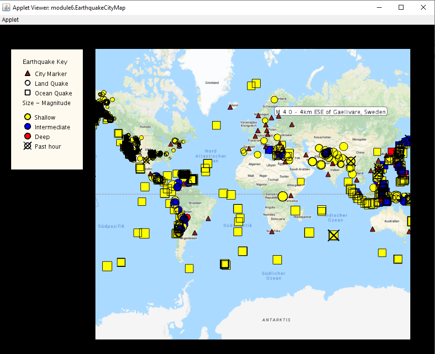

# Unfolding Maps

This project is an interactive visualization of a large dataset tagged by geospatial information. Both powerful and challenging, data visualization is one of the hot topics of modern computer science - as well as something that influences our world every day! It makes use of a package called Unfolding Maps, which is a library for interactive maps and geo-visualizations.

* Created an interactive graphical map that displayed geospatial data using unfolding maps library and essentials of data cleaning and data visualization.

* Used core object oriented programming principles like encapsulation, inheritance, polymorphism and abstraction.

* Implement event driven programming and effecient searching and sorting techniques for data to be displayed.

